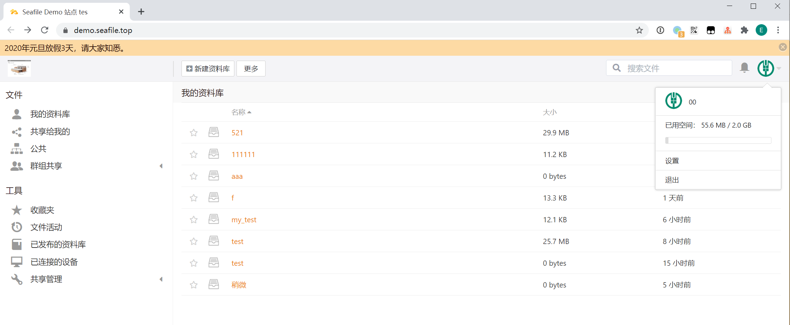

# seafile-docker

docker 一键部署 seafile 私人云盘

------

## 概要

你是否面临以下困扰：

- 免费云盘越来越少了
- 百度云盘限速越来越过分了
- 上传到云盘的文件被服务商泄露了、删掉了
- 不得已用 U 盘、QQ 给小伙伴共享文件
- ......

其实只需要使用 [seafile](https://github.com/haiwen/seafile) 搭建一个私人云盘，这些问题就迎刃而解了：Seafile 是一款开源的企业云盘，注重可靠性和性能，支持文件同步或者直接挂载到本地访问。




## 目录结构说明

```
seafile-docker
├── mariadb ..................... [seafile 数据目录]
├── seafile ..................... [seafile 文件目录]
├── docker-compose.yml .......... [seafile 镜像构建脚本]
├── run.sh ...................... [seafile 服务一键启动脚本]
├── stop.sh ..................... [seafile 服务一键停止脚本]
├── imgs ........................ [README 插图目录]
└── README.md ................... [本仓库说明文档]
```


## 环境要求

  


## 部署步骤

- 宿主机安装 docker、docker-compose
- 宿主机安全组/防火墙（iptables/firewall）放行 80/443 端口的入口流量
- 下载仓库： `git clone https://github.com/lyy289065406/seafile-docker /usr/local/seafile-docker`
- 打开仓库目录： `cd /usr/local/seafile-docker`
- 构建镜像并运行： `./run.sh -u admin -p admin123`
- 浏览器访问 [http://127.0.0.1:80](http://127.0.0.1:80) 即可使用

> 构建时设置的是 seafile 前端的登录账密，另 80 服务端口不可变更，否则文件无法下载
